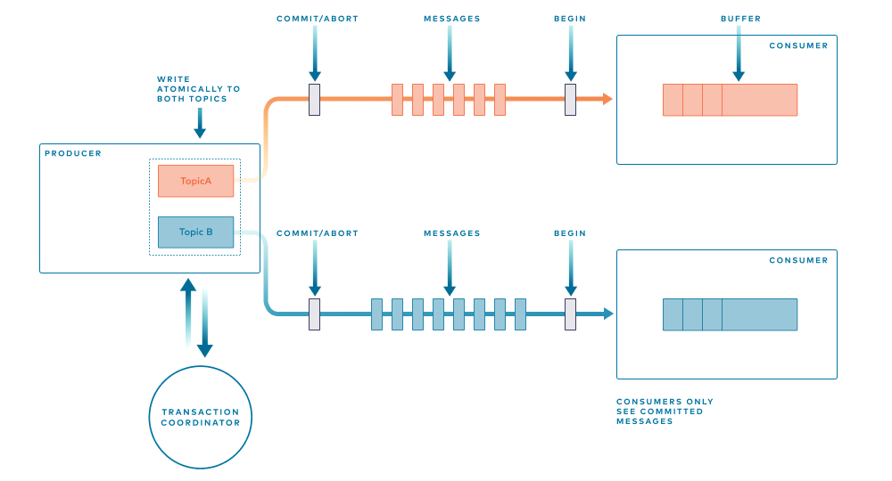

# 100 Days Of Code - Log

### Day 0: June 7, 2022

**Today's Progress**: 

- Started 100 Days of Code chanllenge. Would like to use follow confluent site to explore and master Kafka over 90 days.
  The project scope is not known yet.
  <https://developer.confluent.io/100-days-of-code/>

- Finished #1 Cloud Setup
- Finished #1 local confluent application
- Finished #1 Docker Setup, topic creation, produce message and consumer message

```
docker exec broker \
kafka-topics --bootstrap-server broker:9092 \
             --create \
             --topic quickstart

docker exec --interactive --tty broker \
kafka-console-producer --bootstrap-server broker:9092 \
                       --topic quickstart

docker exec --interactive --tty broker \                                             master  ✭ ✱
kafka-console-consumer --bootstrap-server broker:9092 \
                       --topic quickstart \
                       --from-beginning             
```

**Thoughts:** I have been doing Kafka cources and readings for about two weeks. Really need to get my hands dirty by actually coding it.

**Link to work:** [Docker Compose](https://github.com/chenzhengbc/100-days-of-code/tree/master/docker)


### Day 1: June 8, 2022

***Today's Progress***: 

- Completed <https://developer.confluent.io/learn-kafka/apache-kafka/events/>
  Able to run demo project no problem


### Day 2: June 9, 2022

***Today's Progress***: 

- Completed <https://developer.confluent.io/learn-kafka/apache-kafka/topics/>
- Learned about the concept of topics
- Created topic, created message


### Day 3: June 10, 2022

***Today's Progress***:

- Completed Topics video <https://developer.confluent.io/learn-kafka/apache-kafka/topics/>
- Completed spring boot example
<https://docs.confluent.io/platform/current/tutorials/examples/clients/docs/java-springboot.html?ajs_aid=22b33cfc-40b3-42fb-a59f-a3906d2f23a0&ajs_uid=676219>
- Checked the code and understood how it works
- Created topic, created message


### Day 4: June 11, 2022

***Today's Progress***: Completed Partition Video <https://developer.confluent.io/learn-kafka/apache-kafka/partitions/>
Also read about stream and how stream works - Kafka the definite guide, Chapter 11 - Stream Processing.
Details note and questions will be documented tomorrow.

Kafka can run without zookeer <https://www.confluent.io/blog/kafka-without-zookeeper-a-sneak-peek/>
cat ./config/kraft/server.properties
The role of this server. Setting this puts us in KRaft mode

```
 process.roles=broker, controller          
```

The node id associated with this instance's roles node id=1
The connect string for the controller quorum

```
controller.quorum.voters=1@localhost:9093  
```

cat ./config/kraft/server.properties | grep '^listeners='

```
listeners=PLAINTEXT://:9092,CONTROLLER://:9093
```

./bin/kafka-server-start.sh -daemon ./config/kraft/server.properties


### Day 5: June 12, 2022

***Today's Progress***:

- Read about [How to choose number of topics and partitions](https://www.confluent.io/blog/how-choose-number-topics-partitions-kafka-cluster) 
  - More partition, higher throughput - The degree of parallelism in the consumer (within a consumer group) is bounded by the number of partitions being consumed.
  - Throughput measure
    - You measure the throughout that you can achieve on a single partition for production (call it *p*) and consumption (call it *c*). Let’s say your target throughput is *t*. Then you need to have at least *max(t/p, t/c)* partitions.
  - If the broker is shutdown uncleanly, the total duration of downtime = n ms x Num of Partitions, downtime is propotionally to the number of partitions (Broker Leader election). 
  - Recommended settings is 2K - 4K total # of partitions per broker, or <= 10K per cluster 
- As a rule of thumb, if you care about latency, it’s probably a good idea to limit the number of partitions per broker to *100 x b x r,* where *b* is the **number of brokers** in a Kafka cluster and ***r* is the replication factor**.

- Read about confluent microservice project. See [GitHub Project](https://github.com/confluentinc/pmm/tree/master/confluent-microservices)
  - TODO: Understand and run the <u>Curency Exchange Platform</u> project to see the details
  - TODO: Further understand the [transaction](https://www.confluent.io/blog/transactions-apache-kafka/) in Kafka
  - Step by Step [Video tutorials](https://docs.confluent.io/platform/current/tutorials/examples/microservices-orders/docs/index.html) avaialble

### Day 6: June 13, 2022

**Today's Progress:**

- Learned about transaction 
  - use properties below to ensure two operations are done atomically
    - **processing.guarantee**=**exactly_once** 
    - **ack=all**
  - Process transaction
  - send offset to transaction 
  - Unique
    - Each producer is given a unique identifier
    - Each msg is given a sequence number
    - The combination of the two defines each batch of messages sent
    - if msg in the log discard -> fence out duplicate write
- How that works 
  - 
- What transaction can not do?
  - Not Inter-system transactions - Only work when both consumer and producer use **kafka topics**.
  - calling external service (http, db etc) the transctional guarantees will **NOT** apply
- TODO - finishes the tutorial(https://docs.confluent.io/platform/current/tutorials/examples/microservices-orders/docs/index.html)

### Day 7: June 14, 2022

**Today's Progress:**

- KafkaTemplate
- Messsage Listener
- MessageListenerContainer
- KafkaListener
  - An annotation for POJOs that lets you convert a method into a Kafka consumer
- @KafkaMessageListener 
- TopicBuilder

Message driven pojo

- Enable async communication

- Little or no coupling to Kafka Consumer API 

  


